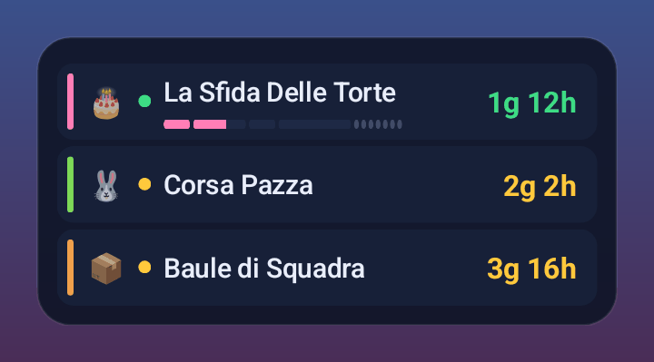
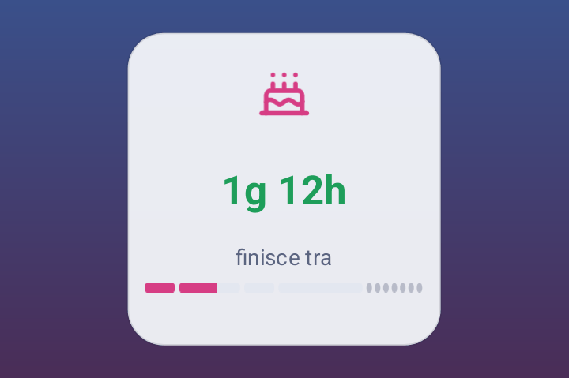

# BlS Tracker – Eventi del Circolo per Burraco la Sfida

Timer degli eventi settimanali del circolo in **Burraco Online: La Sfida**: sito consultabile da qualsiasi telefono
(anche iPhone) e una piccola app Android con i **widget per la schermata Home** e le notifiche.

> Progetto di fan **non ufficiale**, non affiliato a WhatWapp. "Burraco La Sfida" è un marchio dei rispettivi proprietari.
> Nessuna grafica del gioco è inclusa: icone e immagini sono originali o con licenza libera.

**🌐 Sito:** https://alessio-galbo.github.io/Burraco-la-Sfida/
**📱 App Android (APK):** [scarica l'ultima versione](https://github.com/Alessio-Galbo/Burraco-la-Sfida/releases/latest/download/burraco-widget.apk) · [tutte le versioni](https://github.com/Alessio-Galbo/Burraco-la-Sfida/releases)

**📰 Novità:** [NOVITA.md](NOVITA.md) · [changelog tecnico](CHANGELOG.md)

## Eventi e orari (ora italiana)

| Evento | Inizio | Fine |
|---|---|---|
| 🐰 Corsa Pazza | lunedì 12:00 | venerdì 00:00 |
| 📦 Baule di Squadra | mercoledì 02:00 | sabato 02:00 |
| 🎂 La Sfida Delle Torte | venerdì 16:00 | domenica 22:00 |

Fasi delle Torte: Colpi di mestolo (2vs2, ven 16:00) · Torte in forno (1vs1, sab 00:00) · Crema e meringhe (1vs1, sab 16:00) ·
Torta d'oro (2vs2, dom 00:00 → 22:00). Segue il **riepilogo** (dom 22:00 → lun 13:00, nessuna partecipazione):
è mostrato in grigio e non conta come evento in corso; il suo segmento nella barra si può nascondere.
Il cambio dell'ora legale è gestito; il sito mostra gli orari nel fuso del dispositivo.

## Il sito
- Countdown al secondo, eventi in corso in alto, barra delle fasi delle Torte, panoramica della settimana.
- **Calendari** da aggiungere al telefono (promemoria all'inizio e 15 minuti prima, anche ad app chiusa): unico modo per avere avvisi su iPhone.
- Avvisi nel browser mentre la pagina è aperta.
- Stili **Gioco / Chiaro / Sistema**, icone emoji o SVG; funziona offline e si installa come app ("Aggiungi a schermata Home").

## L'app Android (~100 KB)
- Widget ridimensionabile a qualsiasi misura e numero di colonne: **tutti gli eventi**, **prossimo o in corso**, **singolo evento**; se ne possono mettere più di uno.
- Notifiche locali all'inizio degli eventi (e a ogni fase delle Torte), con anticipo a scelta.
- Stili Gioco / Chiaro / Sistema (colori del telefono, Android 12+), icone emoji o SVG, per ogni singolo widget.
- Tocco sul widget: apre il gioco se installato.
- Avvisa quando è disponibile una nuova versione dell'app.

<p>
  
  
</p>

**Installazione:** scarica l'APK, aprilo e consenti l'installazione da questa fonte, poi tieni premuto sulla Home → Widget → **BlS Tracker**.
Gli aggiornamenti sono firmati sempre con la stessa chiave: si installano sopra la versione precedente.

## Privacy
- Nessun account, nessuna pubblicità, nessun tracciamento.
- L'app chiede solo **notifiche**, **avvio all'accensione** (per riprogrammare gli avvisi) e **internet**, usato soltanto per
  scaricare da GitHub gli orari aggiornati (al massimo una volta al giorno) e sapere se esiste una nuova versione. Nessun dato personale viene inviato.
- Se gli orari del gioco cambiano basta aggiornare questo repository: sito, calendari e widget si allineano da soli, senza reinstallare l'app.
- Il sito salva le preferenze solo nel browser (localStorage) e legge da GitHub il numero dell'ultima versione dell'APK.

## Sviluppo

| Cartella | Contenuto |
|---|---|
| `web/` | PWA statica senza build (ES modules), testi in `web/locales/it.json` |
| `web/data/schedule.json` | **Unica fonte degli orari**, usata da sito, calendari e app |
| `tests/` | Test del motore orari e dei calendari; `schedule-cases.json` è condiviso con i test Android |
| `tools/` | Generatore dei calendari `.ics` |
| `android/` | App Kotlin senza librerie esterne (widget, notifiche) |
| `.github/workflows/` | Pubblicazione del sito (GitHub Pages) e dell'APK (GitHub Releases, sui tag `v*`) |

```bash
node --test "tests/*.test.mjs"        # test del sito e dei calendari
node tools/build-ics.mjs               # rigenera web/calendar/*.ics
python -m http.server 8106 --directory web   # sito in locale
cd android && ./gradlew test assembleRelease # test e APK (JDK 17, Android SDK 36)
```

Per cambiare un orario basta modificare `web/data/schedule.json` (e aggiornare i casi in `tests/schedule-cases.json`).
Nuova versione dell'app: `git tag v1.0.1 && git push origin v1.0.1`.

## Supporta il progetto
Se ti è utile puoi offrirmi un caffè: https://ko-fi.com/devangel ☕

## Crediti
Icone [Lucide](https://lucide.dev) (ISC) e [Simple Icons](https://simpleicons.org) (CC0); i loghi dei servizi restano dei rispettivi proprietari.
